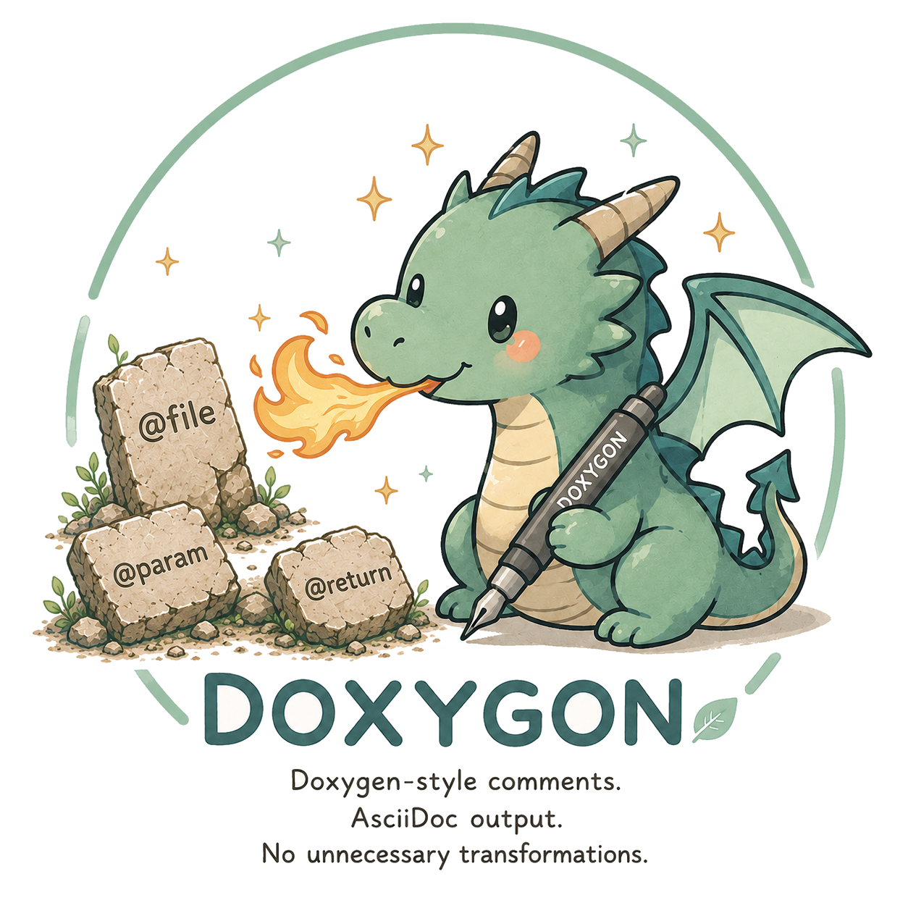
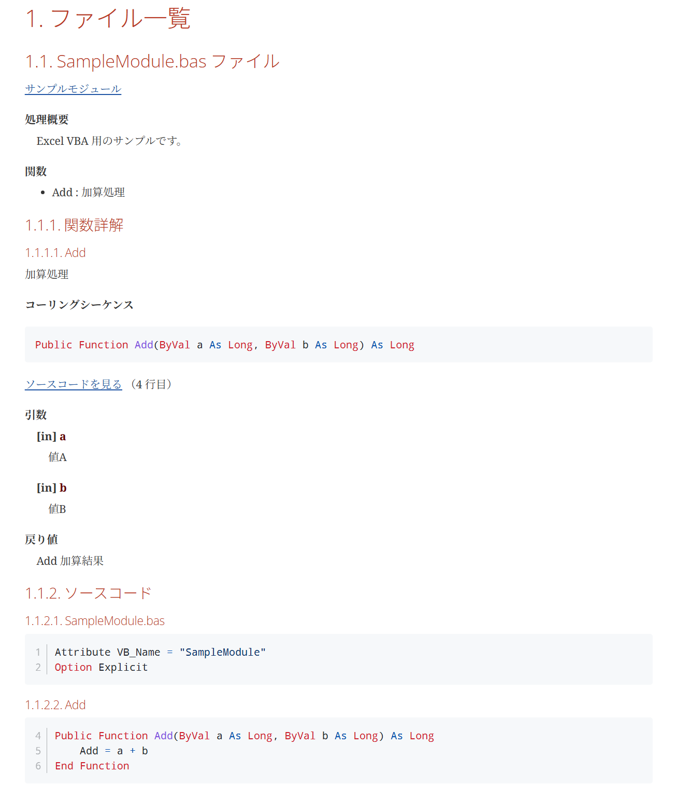

# Doxygon

## Design documents start with comments, not source code.

Doxygon は **Doxygen スタイルのコメントから AsciiDoc ドキュメントを生成するツール**です。

しかし、Doxygon が目指しているのは、単なる「Doxygen の代替ツール」ではありません。

**コメントそのものを設計書として育てること。**

これが Doxygon の基本思想です。

> **We need no sources, only comments.**

一般的なドキュメント生成ツールは、ソースコードを解析して関数やクラスを抽出し、その情報を元にドキュメントを構築します。

一方 Doxygon では、**コメントがドキュメント構造を定義します。**

そのため、

- 設計段階ではコメントだけでドキュメントを作成できる
- 実装後もコメントを更新するだけで設計書を維持できる
- 設計書とソースコードの乖離を最小限に抑えられる

というワークフローを実現します。

<br clear="right">

---

## Example

### Generated Design document

VBA から生成されるドキュメントの一例です。



### VBA Source comments

``` vba
Attribute VB_Name = "SampleModule"
Option Explicit
'/**!
' @file SampleModule.bas サンプルモジュール
'
' @brief
' Excel VBA 用のサンプルです。
'*/

'/**!
' @fn Add 加算処理
'
' @param [in] a 値A
' @param [in] b 値B
'
' @return Add 加算結果
'*/
Public Function Add(ByVal a As Long, ByVal b As Long) As Long
    Add = a + b
End Function
```

---

## Doxygon の特徴

- Doxygen スタイルのコメントを利用
- AsciiDoc を直接生成
- コメント主体でドキュメント構造を構築
- AsciiDoc の機能（PlantUML・Graphviz・数式・表など）をそのまま利用
- HTML / PDF 生成に適した AsciiDoc を出力
- **VBA を正式サポート**

---

## Doxygen との違い

| Doxygen  | Doxygon  |
|----------|----------|
| コード解析中心 | **コメント中心** |
| HTML / XML 指向　 | AsciiDoc 指向 |
| XML 経由 | AsciiDoc を直接生成 |
| VBA は未対応 | VBA をネイティブ対応 |

---

## 対応言語

- **VBA**
- Python
- C
- C++
- Java
- JavaScript
- TypeScript

---

## Quick Start

```bash
python run_doxygon.py
```

---

## 開発の背景

Doxygon は ウォーターフォール型の開発現場で感じた

「設計書は古くなるが、コメントは比較的更新される」

という経験から生まれました。

詳細設計段階から設計情報をコメントへ集約し、そこから AsciiDoc を直接生成することで、

設計書とソースコードを一体化させ、自然に同期させることを目指しています。

コメントを中心に設計情報を管理するという考え方こそ、Doxygon の設計思想そのものです。

---

## ライセンス

BSD 2-Clause License
